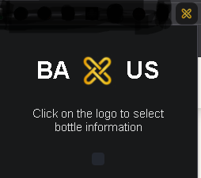
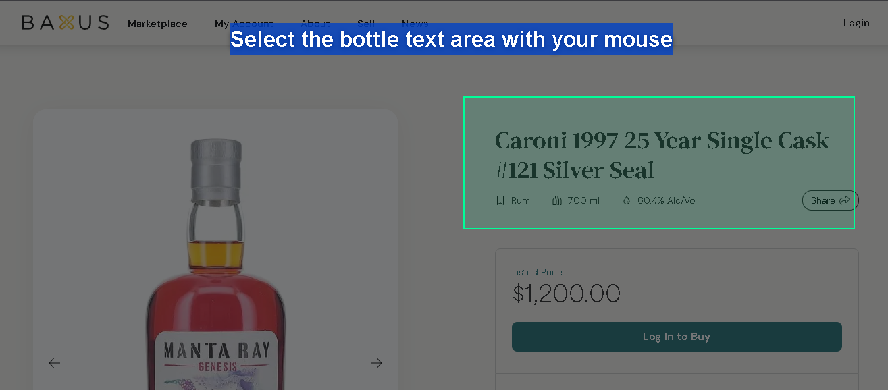
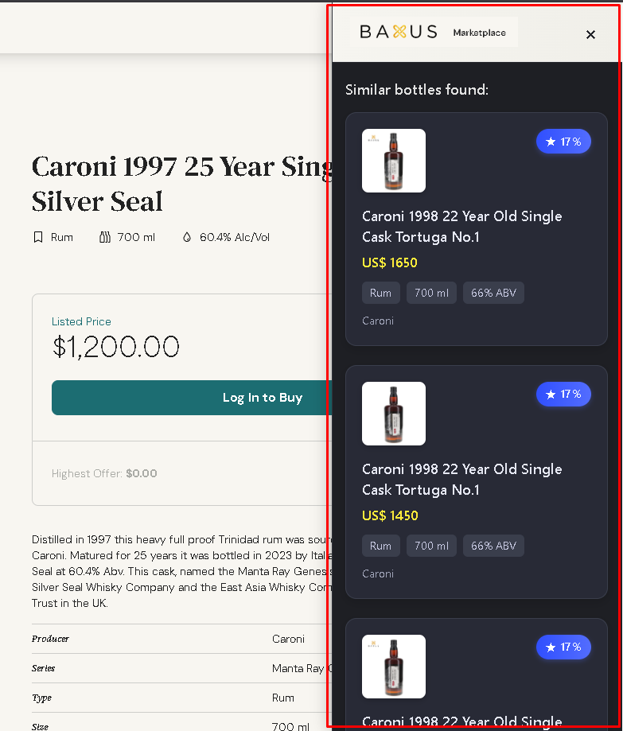

# Baxus - Bottle Identification Extension 🍾

Baxus is a Chrome extension that allows you to identify beverage bottles through selected text on web pages. The extension uses text recognition to find similar bottles in the Baxus catalog.

## Features 🚀

- Screen area selection for text extraction
- Bottle identification through text
- Results display in an elegant sidebar
- Comparison with Baxus catalog

## Screenshots 📸

### Main Interface


*Main extension interface showing the selection start button*

### Area Selection


*Area selection tool in action*

### Results


*Sidebar displaying search results*

## Installation 📦

1. Download the source code
2. Open Chrome and navigate to `chrome://extensions/`
3. Enable "Developer mode" in the top right corner
4. Click "Load unpacked"
5. Select the project folder

## Compatible Sites 🌐

The extension works on any site that displays beverage bottle information, including:

- Beverage e-commerce sites
- Online catalogs
- Beverage review sites
- Specialized blogs

## How to Use 📝

1. Click the extension icon in the toolbar
2. Click the "LOGO BAXUS" button
3. Select the screen area containing the bottle text
4. Wait for results to appear in the sidebar

## Troubleshooting 🔧

### Extension not appearing in toolbar
- Check if the extension is enabled in `chrome://extensions/`
- Try pinning the extension to the toolbar by clicking the extensions icon and the pin

### Area selection not working
- Make sure the page is fully loaded
- Reload the page and try again
- Check if the site allows text selection

### Results not showing
- Check your internet connection
- Make sure the selected text is readable
- Try selecting a smaller and more specific area

## Project Structure 🗂️

```
├── manifest.json           # Extension configuration
├── popup.html             # Popup interface
├── popup.js               # Popup logic
├── content.js             # Injected page script
├── background.js          # Background script
├── sidebar.css            # Sidebar styles
├── overlay.css            # Selection styles
├── listings-helper.js     # Bottle search helper
└── icons/                 # Extension icons
    ├── icon16.png         # 16x16 icon
    ├── icon48.png         # 48x48 icon
    ├── icon128.png        # 128x128 icon
    └── baxus-sidebar.png  # Sidebar logo
```

## Technical Details 🔧

### Manifest.json
- Chrome manifest version 2
- Minimal required permissions
- Multi-size icon configuration

### Scripts
- `background.js`: Manages extension events
- `content.js`: Handles area selection and text extraction
- `listings-helper.js`: Implements catalog search logic

### Styles
- `overlay.css`: Styles the selection tool
- `sidebar.css`: Defines results layout
- `popup.css`: Styles main interface

## Contributing 🤝

Contributions are welcome! Feel free to open issues or submit pull requests.

## License 📄

This project is licensed under the MIT License - see the LICENSE file for details.


Developed by Grottan City Lab.
